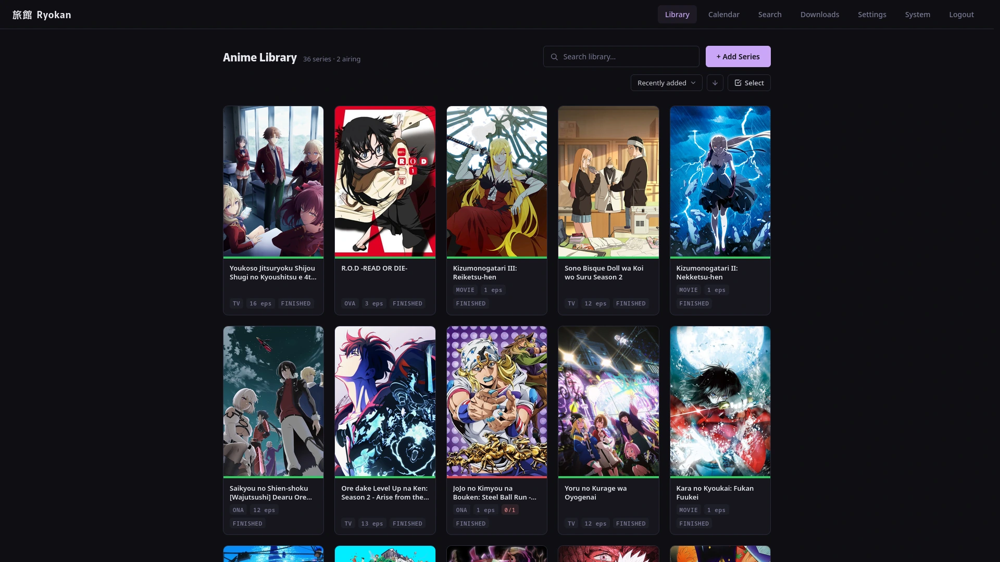
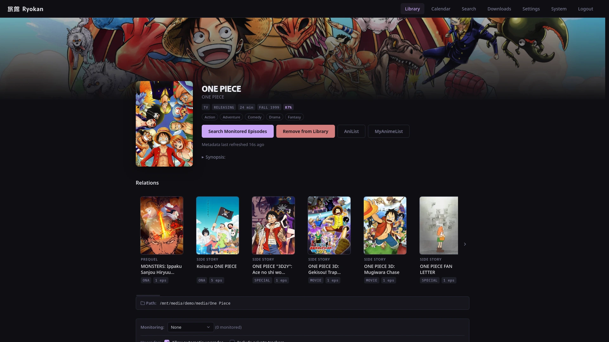
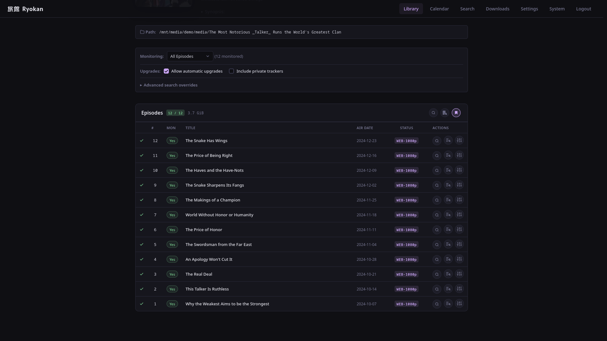
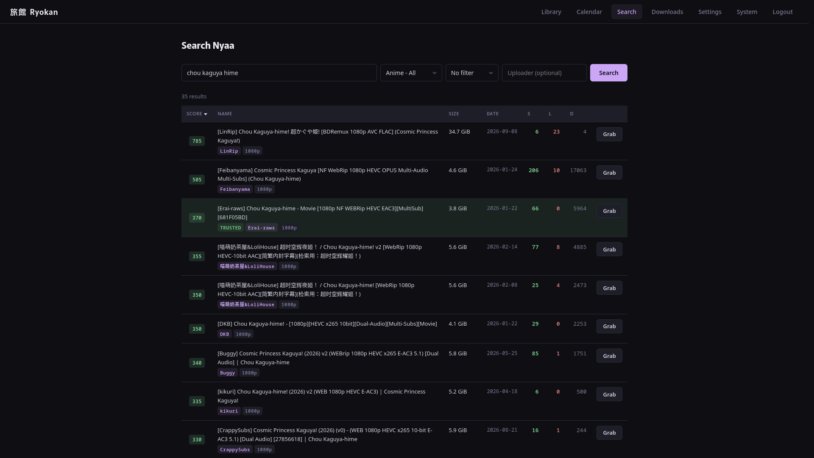

# Ryokan

[](https://github.com/johnthreekay/Ryokan/actions/workflows/rust.yml)
[](LICENSE)

A self-hosted anime PVR written in Rust. Searches indexers for releases, scores them by quality, and sends them to your download client from a single web UI. Supports qBittorrent, Deluge, Transmission, rTorrent/ruTorrent, and SABnzbd.

I built this because Sonarr doesn't always work well for anime. The RSS sync for currently airing shows works just fine, but downloading season batches of shows that've finished airing almost always hangs the interactive search. Sonarr's anime mode searches each episode individually by absolute number, so a finished season means dozens of separate searches per indexer instead of one batch grab.

## Documentation

- [Getting Started](https://johnthreekay.github.io/Ryokan/docs/#get-started): install via Docker, configuration, FAQ.
- [Build from source](https://johnthreekay.github.io/Ryokan/docs/from-source/): for development or non-Docker deployments.

## Screenshots






---

## Status

Actively developed. Expect occasional bugs. See [Releases](https://github.com/johnthreekay/Ryokan/releases) for version-to-version changes.

## Contributing

Bug reports, feature requests, and PRs are welcome. PRs target the `dev` branch and run a verify chain (`cargo fmt`/`clippy -D warnings`/`cargo t`). See [`CLAUDE.md`](CLAUDE.md) for the build prerequisites (`mold` + `clang`, `cmake`, `cargo-nextest`) and the code conventions. Quick version:

```bash
git clone https://github.com/johnthreekay/Ryokan.git
cd Ryokan
cargo run            # serves on 0.0.0.0:8978, creates data/ryokan.db
```

## Security

Please report security issues privately. See [SECURITY.md](SECURITY.md).

## License

Ryokan is licensed under [GPL-3.0-or-later](LICENSE).

Third-party crate notices (MIT / Apache-2.0 / BSD / ISC) are bundled in [`licenses/THIRD_PARTY_LICENSES.html`](licenses/THIRD_PARTY_LICENSES.html).
